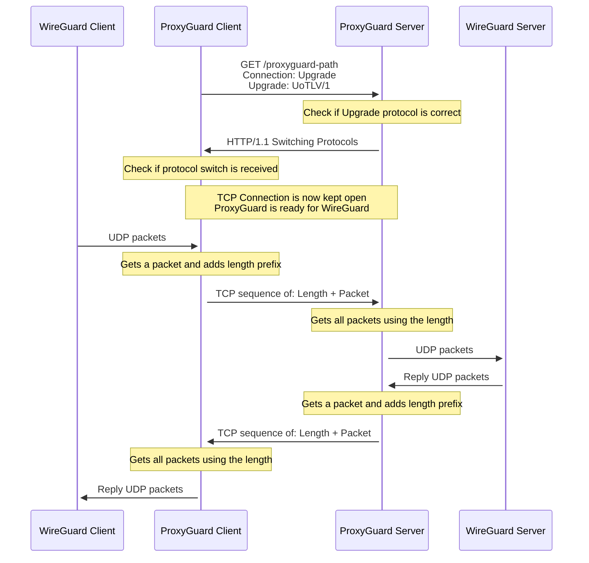

# Technical docs

This document describes technical details for ProxyGuard.

## Handshake
ProxyGuard uses a handshake to negotiate its protocol over HTTP. It does this in a similar way to how
[WebSockets](https://datatracker.ietf.org/doc/html/rfc6455) work:



As can be seen from this diagram, this codebase uses the HTTP Upgrade scheme
to go from a HTTP connection to a regular TCP socket with a custom UoTLV/1
protocol. This protocol will be explained in the next section. 

Going from a HTTP to a TCP (without the HTTP layer) connection is possible in Go
by utilizing a [net/http.Hijacker](https://pkg.go.dev/net/http#Hijacker). In the
code, this is done by calling the `Hijack` on the Server's response writer. The
client can then use the HTTP response body from the protocol upgrade to get a
regular TCP connection. In the Go code, the client gets a simple buffer that can
be read from and written to.

## UDP<->TCP Protocol

The protocol of ProxyGuard for converting UDP to TCP packets and vice-versa is
called UoTLV/1: UDP over TCP Length Value version 1. The name comes from the
fact that UDP packets are encapsulated into TCP packets by prefixing them with
the length of the packet. This is done so that packets which are cut-off due to
fragmentation can be  re-assembled by checking the length value. To illustrate
this packet format, see the following:
```
0........2..................................................65535
+-+-+-+-+-+-+-+-+-+-+-+-+-+-+-+-+-+-+-+-+-+-+-+-+-+-+-+-+-+-+-+-+
| Length | Data                                                 |
+-+-+-+-+-+-+-+-+-+-+-+-+-+-+-+-+-+-+-+-+-+-+-+-+-+-+-+-+-+-+-+-+
```

As can be deduced from this simple ASCII diagram, the Length prefix is always
2 bytes. If we update the protocol we will also update the UoTLV/1 header value
to e.g. UoTLV/2 to indicate version 2 of the protocol is used. The server and
client would then have to support this change of protocol.

## Limitations/Future Work

- Due to the use of Go's HTTP Hijacker API, HTTP/2 is not supported for the
handshake. See https://github.com/golang/go/issues/46319 and https://github.com/golang/go/issues/49918
- It could be that some HTTP reverse proxies only have hard-coded support
for the WebSocket Upgrade connection header. This makes it unable to proxy
ProxyGuard using these reverse proxies. We decided not to use the WebSockets
value in the header as this could potentially cause problems for proxies that
check if the traffic is expected to be actual WebSocket frames anyway. So far we have
only verified that the proxying works nicely with Apache as that can arbitrarily
proxy Upgrade connections
- Currently we have not found an optimal MTU value to use for the WireGuard connections when used with ProxyGuard,
we need to do more testing in the field with different settings
